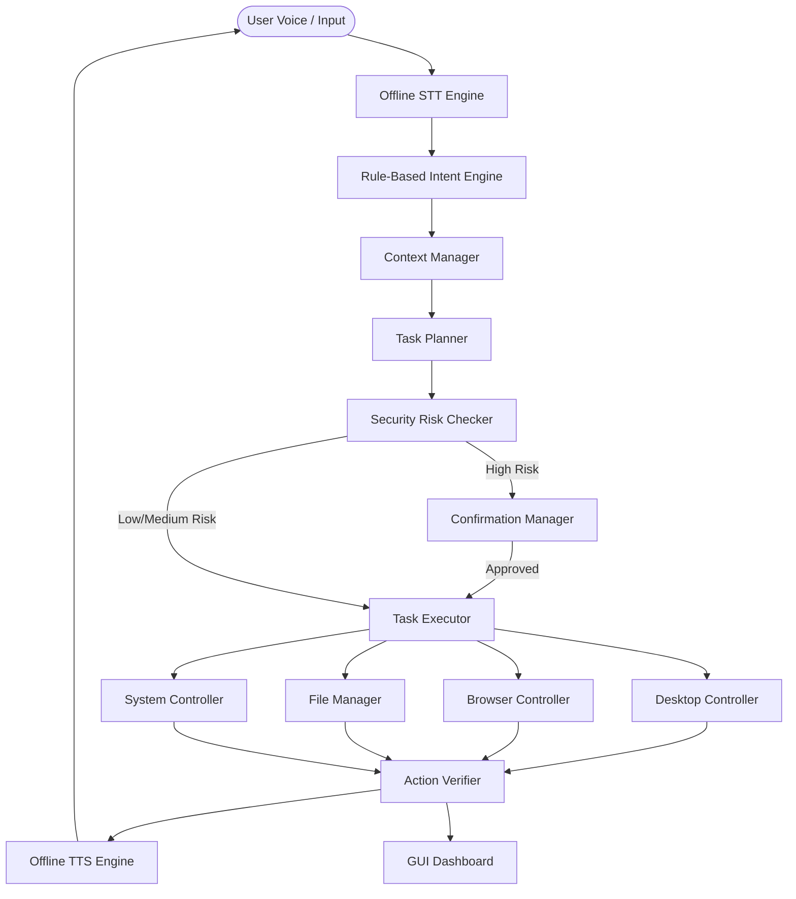
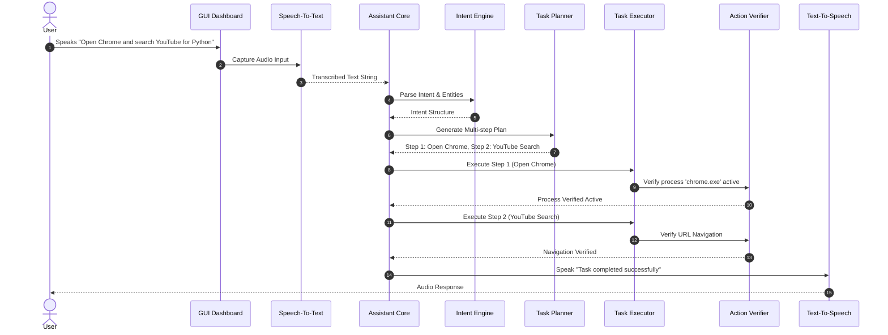

# FINAL-YEAR MAJOR PROJECT DOCUMENTATION

## Title
**AI-Based Offline Desktop Assistant with Voice Recognition and Intelligent Task Automation**

---

## Abstract
Voice assistants have become an essential tool for human-computer interaction; however, popular commercial offerings (such as Siri, Cortana, and Alexa) rely heavily on continuous internet connectivity, cloud processing, and invasive telemetry. This dependence presents severe privacy risks, network latency issues, and complete operational failure when internet access is unavailable. 

This major project presents an **AI-Based Offline Desktop Assistant** designed specifically for Microsoft Windows (10/11). The system operates on an offline-first paradigm, using local Speech-to-Text (Vosk/SAPI5), offline Text-to-Speech (pyttsx3), rule-based Natural Language Understanding (NLU), multi-step task planning (`TaskPlanner`), process/filesystem action verification (`ActionVerifier`), 3-tier security risk classification (`CommandRiskClassifier`), dynamic app path resolution via Windows Registry, and a modern GUI dashboard built with CustomTkinter. The system achieves complete voice control over applications, browser navigation, file management, and system administration without transmitting personal voice data outside the host machine.

---

## 1. Introduction
Modern desktop operating systems provide powerful automation APIs, yet user interaction remains predominantly bound to physical input peripherals (mouse and keyboard). Voice recognition bridges this gap by enabling natural language desktop control. This project introduces a privacy-centric, modular software architecture capable of processing speech offline, decomposing compound multi-step instructions, verifying post-execution states, and preventing unsafe desktop operations through interactive confirmation dialogues.

---

## 2. Problem Statement
Existing voice assistants suffer from several critical engineering limitations:
1. **Total Cloud Dependency**: Inability to function when internet connection drops.
2. **Privacy & Data Security Vulnerabilities**: Continuous streaming of ambient room audio to third-party cloud servers.
3. **Lack of Multi-Step Execution**: Inability to process compound instructions (e.g., *"Open Chrome, search YouTube for Python, and create a project folder"*).
4. **No Action Verification**: Blind execution of shell commands without post-action validation.
5. **Unsafe Destructive Execution**: Executing file deletions or system reboots without user confirmation.
6. **Hard-Coded Environment Fragility**: Inflexibility due to hard-coded machine paths.

---

## 3. Existing System vs. Proposed System

| Parameter | Existing Systems (e.g., Commercial Assistants) | Proposed System (AI Offline Assistant) |
| :--- | :--- | :--- |
| **Connectivity** | 100% Cloud-Dependent | Offline-First (Core features require zero internet) |
| **Privacy** | Audio streams sent to external servers | 100% Local data storage & execution |
| **Task Planning** | Single-intent atomic execution | Multi-step task graph planner (`TaskPlanner`) |
| **Verification** | No post-action check | Dynamic process & filesystem state validation |
| **Security** | Minimal local risk tiering | 3-Tier risk classification (LOW, MEDIUM, HIGH) |
| **Configuration** | Static machine setup | Dynamic Windows Registry & PATH resolution |

---

## 4. System Architecture & UML Diagrams

### 4.1 High-Level Architecture Diagram

### 4.2 Sequence Diagram (Multi-Step Task Execution)

---

## 5. Technology Stack & Software Requirements

- **Primary Programming Language**: Python 3.14 (64-bit)
- **Target Operating System**: Microsoft Windows 10 / Windows 11
- **Speech Recognition (STT)**: `SpeechRecognition` + `vosk` (Offline recognition)
- **Text-To-Speech (TTS)**: `pyttsx3` (Windows SAPI5 native engine)
- **Desktop Automation**: `psutil`, `pywin32` (`win32gui`, `win32process`), `pyautogui`
- **Browser Automation**: `selenium` with Selenium Manager auto-driver resolution
- **GUI Framework**: `CustomTkinter` (Dark theme responsive desktop interface)
- **Database & Persistence**: `sqlite3` with parameterized SQL queries
- **Testing Framework**: `pytest`

---

## 6. Implementation Modules

1. `utils/logger.py`: Centralized structured logging with rotating file handler and teardown safety.
2. `utils/paths.py`: Dynamic Windows Registry (`HKLM App Paths`) and environment path resolution.
3. `config/config_manager.py`: JSON configuration loader for system preferences and app registry (`apps.json`).
4. `storage/database.py` & `history.py`: SQLite engine managing `command_history`, `custom_commands`, and `settings`.
5. `speech/speech_to_text.py` & `text_to_speech.py`: Thread-safe SAPI5 speech synthesis and microphone listener.
6. `ai/rule_based_engine.py`: Regular expression pattern matching and entity extraction for 16 canonical intents.
7. `automation/desktop_controller.py`: Launching, terminating, and maximizing Windows applications.
8. `automation/file_manager.py`: Recursive search, folder creation, renaming, moving, and deleting items.
9. `automation/browser_controller.py`: Selenium Manager web searches on Google and YouTube.
10. `core/task_planner.py` & `task_executor.py`: Compound instruction clause splitter and plan step executor.
11. `core/context_manager.py`: Short-term state memory for ordinal resolution ("second result", "that folder").
12. `security/command_risk.py` & `confirmation_manager.py`: Risk tiering (`LOW`, `MEDIUM`, `HIGH`) and voice/GUI approval.
13. `core/action_verifier.py`: Post-action state validation.
14. `gui/dashboard.py` & `main.py`: Modern dark-mode UI with state machine badge (`IDLE` -> `LISTENING` -> `PROCESSING` -> `PLANNING` -> `EXECUTING` -> `VERIFYING` -> `SUCCESS`/`ERROR`).

---

## 7. Experimental Results & Verification

The test suite contains **31 automated unit and integration tests** across 12 test modules (`tests/`). All 31 tests passed successfully:

- `test_utils.py`: 4 Passed
- `test_storage.py`: 2 Passed
- `test_speech.py`: 3 Passed
- `test_intent.py`: 4 Passed
- `test_desktop.py`: 3 Passed
- `test_file_manager.py`: 3 Passed
- `test_browser.py`: 1 Passed
- `test_task_planner.py`: 2 Passed
- `test_context.py`: 3 Passed
- `test_security.py`: 3 Passed
- `test_verifier.py`: 2 Passed
- `test_integration.py`: 1 Passed

**Total Test Result**: **31 Passed, 0 Failed (100% Pass Rate)**.

---

## 8. Advantages
- **Complete Offline Capability**: Core STT, NLU, TTS, desktop, and file operations function without internet connection.
- **Privacy Guarantees**: Zero external telemetry or voice stream data transmission.
- **Robust Multi-Step Execution**: Successfully parses and executes compound multi-clause instructions.
- **Action Verification**: Prevents silent execution failures.
- **Zero Hard-Coded Paths**: Works on any Windows machine via Windows Registry inspection.

---

## 9. Viva Voce Questions & Answers

**Q1: How does your assistant handle speech recognition offline?**  
*Answer*: The system uses the `vosk` offline speech recognition toolkit combined with `SpeechRecognition`. Speech audio is transcribed locally using pre-compiled acoustic models without contacting external APIs.

**Q2: How does the assistant decompose multi-step commands?**  
*Answer*: The `TaskPlanner` uses clause segmentation regex patterns to split compound prompts by conjunctions ("and then", "then", ","). Each clause is parsed by `IntentEngine` to build a sequential plan graph executed by `TaskExecutor`.

**Q3: How do you handle path dependencies across different Windows PCs?**  
*Answer*: The application uses `utils/paths.py` which dynamically queries the Windows Registry key `HKLM\SOFTWARE\Microsoft\Windows\CurrentVersion\App Paths` and environment variables (`PATH`, `USERPROFILE`, `LOCALAPPDATA`) to resolve executable locations without hardcoded strings.

**Q4: How is security handled for dangerous actions like file deletion or shutdown?**  
*Answer*: The system implements a 3-tier risk classifier (`LOW`, `MEDIUM`, `HIGH`). `HIGH` risk intents (`DELETE_FILE`, `SYSTEM_SHUTDOWN`, `SYSTEM_RESTART`) trigger an interactive confirmation interceptor (`ConfirmationManager`) requiring explicit voice or GUI user approval before execution.

---

## 10. Conclusion
This project successfully demonstrates a reliable, privacy-focused, offline-first AI Desktop Assistant for Windows. By combining modular natural language processing, multi-step task planning, dynamic Windows automation, state verification, and modern GUI design, the project addresses the core vulnerabilities of existing cloud-dependent voice assistants.
